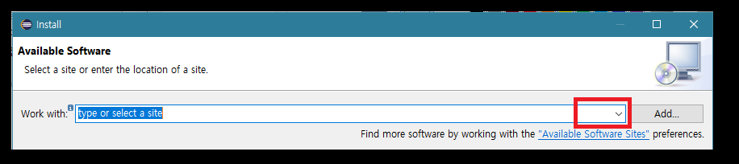

# 1. 개발 툴들의 설치

임베디드 개발 환경을 구축하는 것은 개발 자체 만큼이나 쉽지 않은 과정이라 생각 합니다.

어디서 관련 리소스를 찾아서 어떻게 설치하고 설정하는지에 대해서 아는 것은 굉장히 중요한 첫 걸음이라 하겠습니다.

2017년 9월 24일 현재 본 매뉴얼에서 필요한 파일은 [https://drive.google.com/open?id=0B1vLqsmHksccV0s0aGFaWl9WWnc](https://drive.google.com/open?id=0B1vLqsmHksccV0s0aGFaWl9WWnc)에 모두 업로드 해놓았습니다. 시일이 다소 지난 후에 더 최신의 파일을 사용하기 위해서는 아래 항목들과 링크들을 적절히 활용하시길 바랍니다.

## 1.1 nRF SDK와 어플리케이션

아래 프로그램들은 nRF 제품들과 직접 관련되어 있으며, 노르딕의 웹사이트에서 다운로드 가능 합니다.

* nrf52 SDK \(nRF5\_SDK\_14.0.0\_3bcc1f7.zip\) - [Download](https://www.nordicsemi.com/eng/nordic/Products/nRF5-SDK/nRF5-SDK-zip/59011)
* S132 Software device \(v5\) - SDK에 포함
* nrfgo studio \(nrfgostudio\_win-64\_1.21.2\_installer.msi\) - [Download](https://www.nordicsemi.com/eng/Products/2.4GHz-RF/nRFgo-Studio)
* nrf command line tools \(nrfjprog, v8.5.0\) - nrfgo에 포함
* nrf connect for desktop \(v2.1.0\) - [Download](https://www.nordicsemi.com/eng/Products/Bluetooth-low-energy/nRF-Connect-for-desktop/%28language%29/eng-GB)

SDK에는 기본 라이브러리, 예제 프로그램, 그리고 노르딕의 블루투스 스택인 Soft Device의 이미지 파일 등이 포함 되어 있습니다.

그 외의 파일들\(nRFGO, nRF Connect\)은 SDK를 기반으로 작성된 이미지 파일을 보드에 로드하거나, 완성된 어플리케이션의 테스트를 위해 노르딕에서 제공된 도구들 입니다.

이러한 완성도 높은 리소스 들과 개발 도구를 사용하여 비교적 쉽게 저전력 블루투스 시스템을 개발할 수 있는 것이 노르딕의 제품군의 큰 매력이라고 할 수 있습니다.

## 1.2 SDK의 설치

SDK의 압축을 해제 한 후에 C: 드라이브 \(또는 원하는 위치... 단 한글이 경로에 없도록 주의\)에 복사 합니다.

복사가 완료 되면 폴더의 이름을 **nRF5\_SDK**로 수정 합니다.


## 1.3 J-Link 드라이버와 디버깅 서버

아래 프로그램은 Segger의 J-Link 디버거용 디바이스 드라이버 및 디버깅 서버 입니다.

사실 6.12a 버전이 이미 nrf connect for desktop에 포함되어 있습니다만, 더 최신 버전을 설치하고 싶으신 분들은 Segger의 웹사이트에서 다운로드 받으시면 됩니다 \(**J-Link Software and Documentation Pack** 메뉴 내에서 **J-Link Software and Documentation pack for Windows**의 다운로드를 클릭하여 설치 파일을 저장 합니다\).

* jlink driver \(6.20a\) - [Download](https://www.segger.com/jlink-software.html)

드라이버의 설치가 완료 되면 jlink 바이너리의 경로를 user 환경 변수의 path에 추가해 줍니다.

* 제어판 \(Control Panel\) &gt;&gt; 시스템 &gt;&gt; 정보 &gt;&gt; 시스템 정보 &gt;&gt; 고급 시스템 설정 &gt;&gt; 환경 변수 &gt;&gt; User 환경 변수  
* **Path** 환경 변수에 **C:\Program Files \(x86\)\SEGGER\JLink\_V620a** 를 추가 합니다. \(경로는 실제 버전에 따라 맞춰서 입력 바랍니다.\)


## 1.4 배시셸과 유닉스 어플리케이션

MSYS2는 윈도우즈용 배시셸\(+ pacman 매니저\) 입니다. bash, make 등의 유닉스 유틸리티를 사용하기 위해서 설치 합니다. \(설치 후에는 바탕화면 또는 작업 표시줄에 바로가기를 만들어 둡니다.\)

* msys2 \(20161025\) - [Download](http://www.msys2.org/)

설치가 완료 된 후에는 다음과 같은 작업을 진행하여 환경을 설정 합니다.

### 1.4.1 시스템 변수 "MSYS2 PATH TYPE"의 설정

아래 과정을 통해 변수가 설정되어 있어야 MSYS2의 배쉬 셸이 윈도우즈의 환경 변수를 읽을 수 있습니다.

* 제어판 \(Control Panel\) &gt;&gt; 시스템 &gt;&gt; 정보 &gt;&gt; 시스템 정보 &gt;&gt; 고급 시스템 설정 &gt;&gt; 환경 변수 &gt;&gt; USER 환경 변수
* **환경 변수 추가하기**를 통해 **MSYS2\_PATH\_TYPE** 변수에 **inherit** 값을 대입 합니다.


### 1.4.2 시스템 변수 Path의 설정

아래 변수가 설정되어 있어야 MSYS2를 통해 설치한 유닉스 유틸리티에 윈도우즈 프로그램들이 접근할 수 있습니다.

* 제어판 \(Control Panel\) &gt;&gt; 시스템 &gt;&gt; 정보 &gt;&gt; 시스템 정보 &gt;&gt; 고급 시스템 설정 &gt;&gt; 환경 변수 &gt;&gt; 시스템 환경 변수
* **Path** 환경 변수에 **C:\msys64\usr\bin** 를 추가 합니다.

### 1.4.3 기본 유닉스 유틸리티들의 설치

이제, 실제로 유닉스 유틸리티들을 설치해 보도록 합니다.  
MSYS2를 실행하고 아래 명령어들을 입력 합니다.

```
$ pacman -Syuu 
$ pacman -S tar git tree vim base-devel
```

첫 번째 명령어는 원격 저장소와 로컬 저장소의 리스트를 동기화하고 시스템을 업데이트 합니다.  
두 번째 명령어는 개발에 사용할 유틸리티들을 설치 합니다.

## 1.5 크로스 툴체인 등의 설치

다음으로는 ARM용 크로스 툴체인을 설치 합니다.

### 1.5.1 크로스 툴체인의 설치

일반 PC 상에서 ARM용 어플리케이션을 개발하기 위해서는 소스코드를 ARM용 이미지로 컴파일할 수 있어야 하며, 해당 작업을 하기 위해서 ARM용 컴파일러를 포함한 툴을 설치해야 합니다.

* arm gcc cross tool chain \(5.4-2016q3\) - [Download](https://launchpad.net/gcc-arm-embedded/5.0/5-2016-q3-update/+download/gcc-arm-none-eabi-5_4-2016q3-20160926-win32.exe)

설치를 마친 후 Path에 위치를 추가 합니다. \(이 작업은 인스톨러의 옵션을 이용하여 대신 할 수 있으니 설치 시 눈 여겨 보시기 바랍니다.\)

* 제어판 \(Control Panel\) &gt;&gt; 시스템 &gt;&gt; 정보 &gt;&gt; 시스템 정보 &gt;&gt; 고급 시스템 설정 &gt;&gt; 환경 변수 &gt;&gt; User 환경 변수
* **Path** 환경 변수에 **C:\Program Files \(x86\)\GNU Tools ARM Embedded\5.4 2016q3\bin** 를 추가 합니다. \(경로는 실제 버전에 따라 맞춰서 입력 바랍니다.\)

### 1.5.2 SDK를 위한 Makefile의 수정

툴체인의 위치를 Path에 추가해 준 후에는 노르딕의 SDK에서 제공하는 **Makefile.windows**를 수정하여 GCC의 위치와 버전을 설정해 주어야 합니다.

* **C:\nRF5\_SDK\components\toolchain\gcc**에 위치한 **Makefile.windows**를 열어 줍니다. 
* **GNU\_INSTALL\_ROOT**의 값은 **C:/Program Files \(x86\)/GNU Tools ARM Embedded/5.4 2016q3/bin/**로 설정 합니다. \(슬래시의 방향에 주의 바랍니다.\) 
* **GNU\_VERSION**의 값은 **5.4.1**로 설정 합니다. \(이 값을 확인하기 위해서는 **powershell**에서 **arm-none-eabi-gcc -v** 를 통해 나온 출력값을 참조 합니다.\)  


## 1.6 JRE와 이클립스 설치

nRF5 시리즈와 SDK는 3 가지 컴파일러에 대응 합니다. IAR과 KEIL 컴파일러는 개발자들의 편의를 위해 전용의 IDE를 제공하므로 따로 IDE를 설치할 필요가 없지만, 우리가 사용하고자 하는 **GCC 컴파일러를 IDE 환경에서 사용하기 위해서**는 따로 IDE를 설치해 주어야 합니다. 여기서는 이클립스를 사용하도록 하겠습니다.

### 1.6.1 JRE의 다운로드와 설치

이클립스를 사용하기 위해서는 먼저 JRE를 설치 해 주어야 합니다.  
JRE는 Eclipse가 동작하기 위한 런타임 환경을 제공 합니다. 아래 링크에서 접속하여 윈도우즈용 64 비트 버전의 exe 파일을 받아 실행해 줍니다. 파일명은 아마도 jre-8uNNN-windows-x64.exe일 것 입니다.

* jre \(8uNNN\) - [Download](http://www.oracle.com/technetwork/java/javase/downloads/jre8-downloads-2133155.html)

### 1.6.2 이클립스의 다운로드와 설치

Eclipse는 아래 링크에 접속하여 다운로드 받을 수 있습니다.  
파일명은 아마도 eclipse-cpp-neon-3-win32-x86\_64.zip일 것 입니다.

* eclipse CDT \(Neon3\) - [Download](http://www.eclipse.org/downloads/packages/eclipse-ide-cc-developers/neon3)

다운로드 후에는 압축을 해제 합니다.

* 압축을 해제하면 해당 폴더 내에는 **eclipse** 폴더가 있는 것을 알 수 있습니다. 
* 이 eclipse 폴더를 **C:\Program Files**에 복사 해놓습니다.
* 또 이 eclipse 폴더 안에는 **eclipse.exe**가 있습니다. 이 exe 파일을 더블 클릭하면 우리가 필요로 하는 Eclipse Neon 3가 실행 되는 것을 알 수 있습니다. \(바탕화면이나 작업 표시줄에 바로가기를 만들어 둡시다.\)


## 1.7 이클립스 애드온의 설치

여느 IDE와 마찬가지로 Eclipse도 여러 패키지를 추가할 수 있는 방법을 제공 합니다.

### 1.7.1 이클립스 마켓 플레이스를 통한 애드온의 설치

상단 메뉴에서 **Help &gt;&gt; Eclipse Marketplace**를 찾아 실행하면 다양한 add-on들을 설치할 수 있습니다.

* GNU MCU Eclipse를 찾아서 설치 합니다.
* Vrapper도 찾아서 설치 합니다. \(에디터의 Vim navigation을 선호하시면 설치하세요!\)


### 1.7.2 애드온의 활성화 \(Optional\)

위에서 설치한 Add-on 중에서 자동으로 활성화 되지 않는 패키지를 활성화 시켜야 할 수도 있습니다.

* 상단 메뉴에서 **Help &gt;&gt; Install New Software**를 통해 열린 창에서 **Work with:** 드롭다운 메뉴를 열어 줍니다.  
* **Neon** \(또는 CDT 9.2.x\) 을 선택한 후 잠시 기다려 줍니다.    
* \(Pending을 마치면\) 하단의 리스트에서 **Mobile and Device Development**를 열고 **Hardware Debugging**을 선택한 후에 최 하단의 Next를 눌러 설치를 진행 합니다.
* \(Pending을 마치면\) 하단의 리스트에서 **Programming Languages**를 열고 **C/C++ Development Tools**를 선택한 후에 최 하단의 Next를 눌러 설치를 진행 합니다.



### 1.7.3 마켓 플레이스에서 애드온 설치가 안 될 때 \(Optional\)

이클립스 마켓 플레이스에서 GNU MCU Eclipse 플러그인의 설치가 어려울 경우.

* 상단 메뉴에서 **Help &gt;&gt; Install New Software**를 통해 열린 창에서 **Add** 버튼을 눌러 줍니다.
* **Name**은 **GNU MCU Eclipse Plug-ins**로 입력 합니다. 
* **Location**은 [http://gnu-mcu-eclipse.netlify.com/v4-neon-updates](http://gnu-mcu-eclipse.netlify.com/v4-neon-updates) 로 입력 합니다.
* 이후 Install 창에서 생성 된 리스트에서 필요한 패키지 \(GNU ARM & RISC-V 아래 패키지 모두\) 선택하여 설치 합니다. 


### 1.7.4 ARM MCU Packs Perspective의 활성화 \(Optional, Outdated\)

ARM 기반 MCU들의 자료들을 다운로드 할 수 있는 Perspective도 활성화 시키도록 합니다. \(현재로써 이 옵션을 통해 얻을 수 있는 자료가 다소 시일이 지났기에 굳이 진행하지 않아도 됩니다....\)

* 상단 메뉴에서 **window menu &gt;&gt; perspective &gt;&gt; open perspective &gt;&gt; other**를 실행하면 나오는 화면에서 **packs &gt;&gt; update**를 실행합니다. 
* 업데이트가 완료되면 해당 퍼스펙티브에서 리스트를 확인할 수 있으며, 각 패키지를 우클릭하면 인스톨이 가능 합니다. 인스톨 된 패키지는 **C:\Users\USERNAME\Packages**에 설치 됩니다.  

## 1.8 이클립스에서의 gcc, jlink 위치 확인

이클립스의 애드온 설치를 마쳤다면 이클립스가 gcc와 jlink server의 위치를 정확히 인식 했는지 확인 하도록 합니다.

* 상단 메뉴에서 **window menu &gt;&gt; preferences**를 실행하면 나오는 preferences 화면에서 **MCU &gt;&gt; Global ARM Toolchains Paths**를 확인 합니다. 
* 상단 메뉴에서 **window menu &gt;&gt; preferences**를 실행하면 나오는 preferences 화면에서 **MCU &gt;&gt; Global Segger J-Link Paths**를 확인 합니다. 기존에 설치한 Segger의 경로를 확인하고, **JLinkGDBServerCL.exe**를 확인합니다. 


## 1.9 기타

아래 프로그램들은 현 단계에서는 굳이 설치할 필요는 없지만 존재 자체에 대해서는 언급 될 필요가 있습니다.

소프트웨어 개발이 어느 정도 진행 된 후에는 다양한 테스트들\(유닛 테스트, 리그레션 테스트 등\)이 진행 되어야 하는데, 개발자나 테스트 엔지니어가 일일이 수작업을 통해 테스트 작업을 진행하는 것은 무리가 있습니다.

따라서 다양한 시나리오에 기반한 테스트를 자동화하기 위해서 아래 프로그램들이 유용하게 사용 될 수 있을 것 입니다.

* pynrfjprog \(pynrfjprog-9.6.0.zip\) - [Download](https://www.nordicsemi.com/eng/content/download/87798/1481500/file/pynrfjprog-9.6.0.zip)
* anaconda \(4.4.0\) - [Download](https://www.anaconda.com/download/)

## 1.10 설치 끝, 쉬는 시간

여기까지 진행 하셨다면 벌써 절반은 마친 셈 입니다.

일단 10분 간 쉬며 물 한잔 마시고 화장실도 다녀오도록 합니다.

이후로는 위에서 설치한 도구들을 이용해 실제 작업을 진행하게 됩니다.

