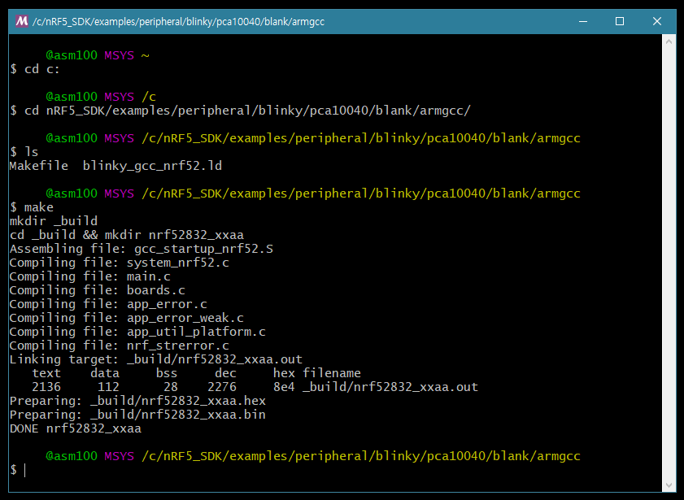

# 2. 기본 프로젝트의 컴파일

드디어 SDK와 함께 설치 된 예제를 컴파일 해볼 때 입니다.

MCU를 이용하는 임베디드 프로젝트라면 **GPIO를 이용하여 LED를 점멸하는 것**이 제일 기본적인 프로젝트라고 할 수 있을 것이며, 이를 위하여 노르딕에서는 **Blinky**라는 이름의 프로젝트를 제공하고 있습니다.

## 2.1 컴파일 해보기

Blinky 프로젝트를 컴파일 하기 위해, 기존에 설치했던 **MSYS2 콘솔**을 실행 하고 아래와 같이 명령어를 입력 합니다.

```
$ cd C:\nRF5_SDK\examples\peripheral\blinky\pca10040\blank\armgcc
$ make
```

크로스 툴체인과 관련 유닉스 툴들이 제대로 설치 되었다면 아래 이미지와 같은 결과를 볼 수 있습니다.

또한 해당 디렉토리에는 **\_build** 디렉토리가 새로 생성 되었으며 그 안에는 out 파일과 hex 파일들이 생성 된 것을 확인 할 수 있습니다.



## 2.2 hex 파일 로드하기

이렇게 생성된 hex 파일은 세가지 방법\(nrfjprog, JLinkExe, nrfgo studio\)으로 보드에 로드할 수 있습니다.

* 커맨드 라인 툴인 nrfjprog와 JLinkExe를 사용하는 방법은 각각의 매뉴얼을 참조 바랍니다.
* GUI 툴인 nrfgo studio의 경우에는 USB로 연결된 보드의 검색과 hex 파일의 로드 등의 작업을 쉽게 진행 할 수 있습니다.

컴파일 된 프로젝트의 결과물인 hex 파일을 보드에 로드하면, 개발 보드에 실장 된 4개의 LED가 순차적으로 점멸하는 것을 확인 할 수 있습니다.


