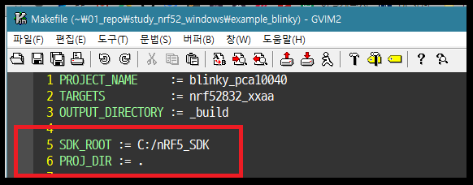

# 3. 기본 프로젝트 정리하기

툴들이 제대로 설치 되고 커맨드 라인에서 컴파일도 무사히 되셨나요?

이 항목에서 진행할 것은 예제 프로젝트에서 몇가지 파일을 모아서 정리함으로써 프로젝트 구조를 간략화 시키는 내용 입니다.

이러한 작업을 함으로써 이클립스에서 작업 할 프로젝트의 구조를 간소화 할 수 있는 장점이 있습니다.

## 3.1 정리하기 전에는...

우리가 직전에 컴파일 했던 프로젝트는 blinky... 즉, 보드에 장착된 LED를 순차적으로 점멸하는 아주 간단한 프로젝트 였습니다. 

실제로 해당 디렉토리를 열어보면 다음과 같은 구조인 것을 알 수 있습니다.

    USERNAME@asm100 MSYS /c/nRF5_SDK/examples/peripheral/blinky
    $ tree
    .
    |-- blinky.eww
    |-- hex
    |   |-- blinky_pca10040.hex
    |   |-- blinky_pca10040_s132.hex
    |   |-- blinky_pca10056.hex
    |   `-- license.txt
    |-- main.c
    |-- pca10040
    |   |-- blank
    |   |   |-- arm4
    |   |   |   |-- blinky_pca10040.uvopt
    |   |   |   `-- blinky_pca10040.uvproj
    |   |   |-- arm5_no_packs
    |   |   |   |-- blinky_pca10040.uvoptx
    |   |   |   `-- blinky_pca10040.uvprojx
    |   |   |-- armgcc
    |   |   |   |-- Makefile
    |   |   |   |-- _build
    |   |   |   |   |-- nrf52832_xxaa
    |   |   |   |   |   `-- 이하 생략
    |   |   |   |   |-- nrf52832_xxaa.bin
    |   |   |   |   |-- nrf52832_xxaa.hex
    |   |   |   |   |-- nrf52832_xxaa.in
    |   |   |   |   |-- nrf52832_xxaa.map
    |   |   |   |   `-- nrf52832_xxaa.out
    |   |   |   `-- blinky_gcc_nrf52.ld
    |   |   |-- config
    |   |   |   `-- sdk_config.h
    |   |   `-- iar
    |   |       |-- blinky_iar_nRF5x.icf
    |   |       |-- blinky_pca10040.ewd
    |   |       `-- blinky_pca10040.ewp
    |   `-- s132
    |       |-- arm4
    |       |   |-- blinky_pca10040_s132.uvopt
    |       |   `-- blinky_pca10040_s132.uvproj
    |       |-- arm5_no_packs
    |       |   |-- blinky_pca10040_s132.uvoptx
    |       |   `-- blinky_pca10040_s132.uvprojx
    |       |-- armgcc
    |       |   |-- Makefile
    |       |   `-- blinky_gcc_nrf52.ld
    |       |-- config
    |       |   `-- sdk_config.h
    |       `-- iar
    |           |-- blinky_iar_nRF5x.icf
    |           |-- blinky_pca10040_s132.ewd
    |           `-- blinky_pca10040_s132.ewp
    `-- pca10056
        `-- blank
            |-- arm4
            `-- 이하 생략 

    23 directories, 57 files

저 57개의 파일 중에서 실제로 우리에게 필요한 파일은 **단 4개 뿐 **입니다.

* C:/nRF5\_SDK/examples/peripheral/blinky/_**main.c**_
* C:/nRF5\_SDK/examples/peripheral/blinky/pca10040/s132/config/_**sdk\_config.h**_
* C:/nRF5\_SDK/examples/peripheral/blinky/pca10040/s132/armgcc/_**blinky\_gcc\_nrf52.ld**_
* C:/nRF5\_SDK/examples/peripheral/blinky/pca10040/s132/armgcc/_**Makefile**_

물론 다양한 종류의 컴파일러에 generic 하게 대응하기 위한 구조이므로 노르딕 반도체의 개발자들의 수고에 감사해야 하겠지만, 우리에게 필요한 파일들만 추려내어 개발 및 보존하는 것이 중장기적 개발 계획에 맞는 방향이라 하겠습니다.

## 3.2 필요한 파일들 모으기

이제 새 프로젝트의 root로 사용 될 디렉토리를 만들고 앞서 언급된 파일들을 모아 보겠습니다.

* 먼저, 저 4개의 파일을 모아둘 디렉토리를 하나 만들어 둡니다. 예를들어, **C:\Users\USERNAME**에 **example\_blinky**라는 디렉토리를 생성하도록 하겠습니다 \(**C:\Users\USERNAME\example\_blinky**\)
* 해당 파일들을 복사해서 **example\_blinky** 디렉토리에 붙여넣기 합니다.
* 추가로 **C:\Program Files \(x86\)\GNU Tools ARM Embedded\5.4 2016q3\lib\gcc\arm-none-eabi\5.4.1** 디렉토리에서 **include** 디렉토리도 복사해서 **example\_blinky**에 붙여넣기 합니다. \(이렇게 헤더파일을 모두 복사하는 것은 다소 낭비인 면이 있습니다만, 해당 헤더파일의 경로에 있는 white space들이 Makefile을 이용함에 불편을 끼치기 때문에 쉬운 방법을 택하였습니다... \)

결과적으로 디렉토리의 내용은 아래와 같을 것 입니다.

    USERNAME@asm100 MSYS /c/Users/USERNAME/example_blinky
    $ tree
    .
    |-- Makefile
    |-- blinky_gcc_nrf52.ld
    |-- include
    |   |-- arm_acle.h
    |   `-- 이하 생략
    |-- main.c
    `-- sdk_config.h

    1 directory, 23 files


## 3.3 Makefile 수정하기

붙여 넣은 Makefile을 열어 다음 내용을 수정해 줍니다.

* SDK\_ROOT: "../../../../../.."를 **C:/nRF5\_SDK**로 수정
* PROJ\_DIR: "../../.."를 "."로 수정 
* INC\_FOLDERS: **../config**를 **./include**로 수정



## 3.4 컴파일 해보기

여기까지 프로젝트의 간소화를 진행하였으니 컴파일이 잘 되는지 확인해 봐야 할 것 입니다.  
MSYS2 콘솔을 실행 하고 아래와 같이 명령어를 입력 합니다.

```
$ cd C:\Users\USERNAME\example_blinky
$ make
```

위 명령으로 프로젝트가 컴파일 되어 hex 파일이 생성 되는 것을 확인할 수 있습니다.

