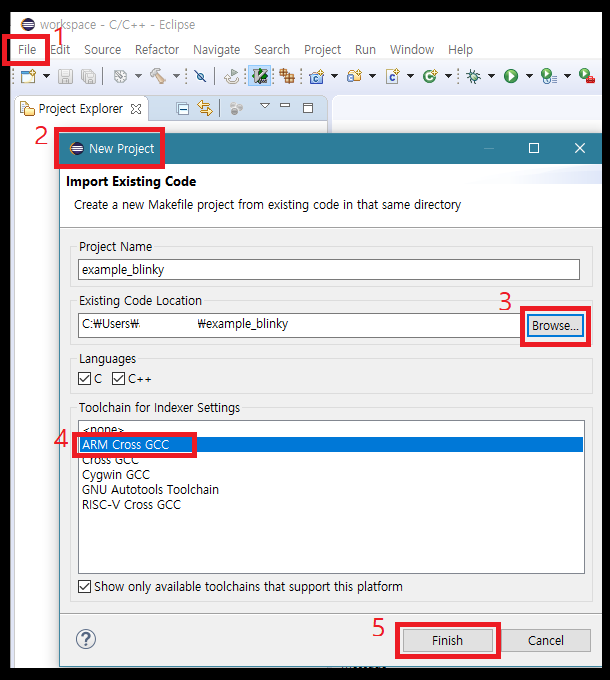

# 4. 이클립스에서 기본 프로젝트 불러오기

이제 드디어 이클립스로 간소화된 프로젝트를 불러 들일 차례가 되었습니다.

## 4.1 Makefile project with existing project

이클립스를 실행 시킨 후에 상단 메뉴의 **File &gt;&gt; New &gt;&gt; Makefile project with existing project**를 클릭 합니다.

위 이미지의 순서대로 진행하면 import가 되어, Project Exploler에 example\_blinky에서 프로젝트 내의 파일들을 리스트 상에서 확인할 수가 있게 됩니다.

