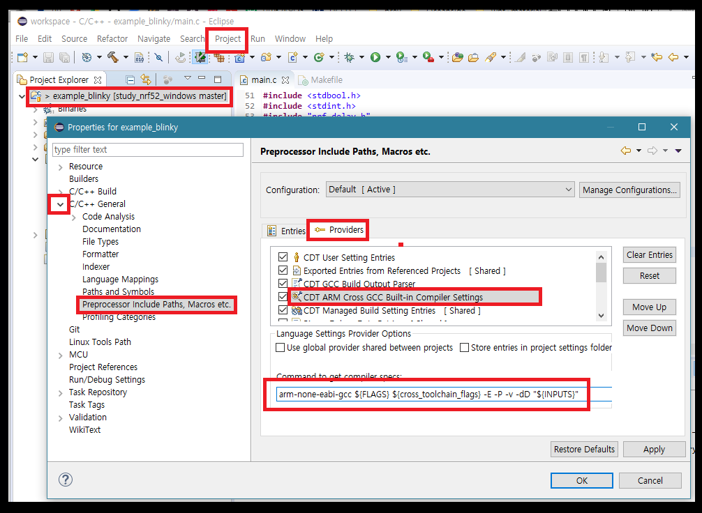

# 5. 이클립스에서 기본 프로젝트 컴파일하기

프로젝트를 불러오고 나서도 전처리기를 위한 몇가지 설정을 수정해 줘야 컴파일을 진행할 수 있습니다.

## 5.1 빌드 옵션 설정하기

아래 작업을 통해 이클립스의 빌드 메뉴와 실제 작업을 매칭할 수 있습니다. 즉, 이를 통해 이클립스의 빌드 메뉴를 클릭하거나 단축키를 누르면 백그라운드에서 make 명령을 실행하는 것이 설정 됩니다.

* 프로젝트 익스플로러에서 **프로젝트 이름**을 클릭 &gt;&gt; 상단 메뉴에서 Project &gt;&gt; Properties \(또는 프로젝트 이름을 우클릭\)
* Properties for example\_blinky 창의 좌측 리스트에서 C/C++ Build 클릭
* Build command의 내용을 **make VERBOSE=1**로 수정

## 5.2 전처리기 설정

코드 내에 선언 된 전처리기와 include 등을 IDE에 연동 합니다.

* 프로젝트 익스플로러에서 **프로젝트 이름**을 클릭 &gt;&gt; 상단 메뉴에서 Project &gt;&gt; Properties \(또는 프로젝트 이름을 우클릭\)
* Properties for example\_blinky 창의 좌측 리스트에서 C/C++ General 클릭하여 확장
* Preprocessor Include Paths, Macros etc. 클릭
* 우측에서 Provider 클릭
* 리스트에서 **CDT GCC Build Output Parser** 클릭 
* Compiler command pattern의 내용을 이미지처럼 입력... \(앞뒤에 white space가 없어야 합니다.\)

## 5.3 컴파일러 옵션의 설정

아래 과정을 통해 사용할 컴파일러의 바이너리를 **arm-none-eabi-gcc**로 특정 합니다.

* 다시 프로젝트 익스플로러에서 **프로젝트 이름**을 클릭 &gt;&gt; 상단 메뉴에서 Project &gt;&gt; Properties \(또는 프로젝트 이름을 우클릭\)
* Properties for example\_blinky 창의 좌측 리스트에서 C/C++ General 클릭하여 확장
* Preprocessor Include Paths, Macros etc. 클릭
* 우측에서 Provider 클릭
* 리스트에서 **CDT ARM Cross GCC Built-in Compiler Settings** 클릭 
* Command to get compiler specs의 내용에서 맨 앞의 ${Command}를 **arm-none-eabi-gcc**로 수정 

## 5.4 프로젝트의 컴파일

모든 수정이 끝났다면 상단 메뉴의 Project &gt;&gt; Clean을 클릭해서 프로젝트를 재빌드 해봅니다.

Console 창에서 이미지와 같은 메세지가 확인이 되고, Problems에서 에러가 없다면 컴파일이 잘 된 것 입니다.

