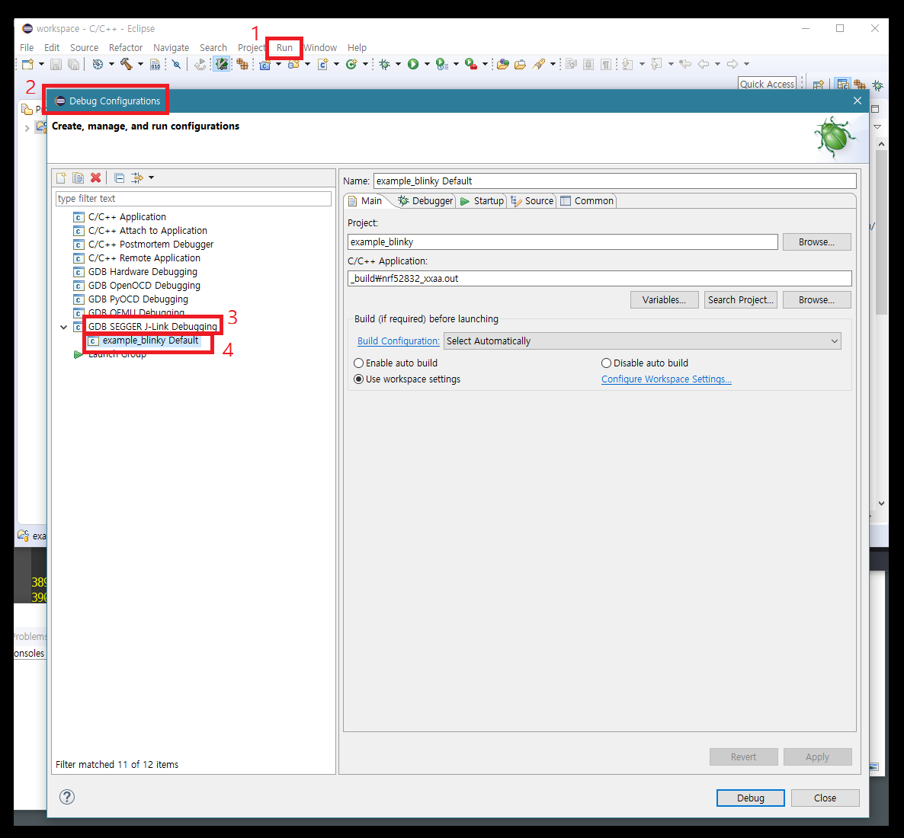
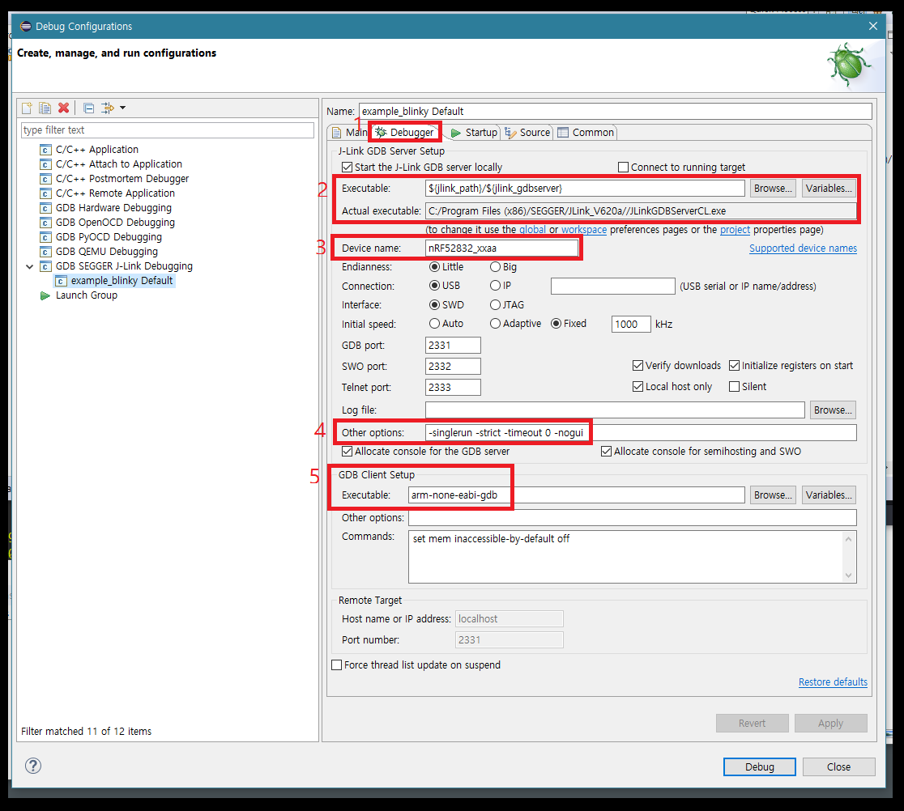
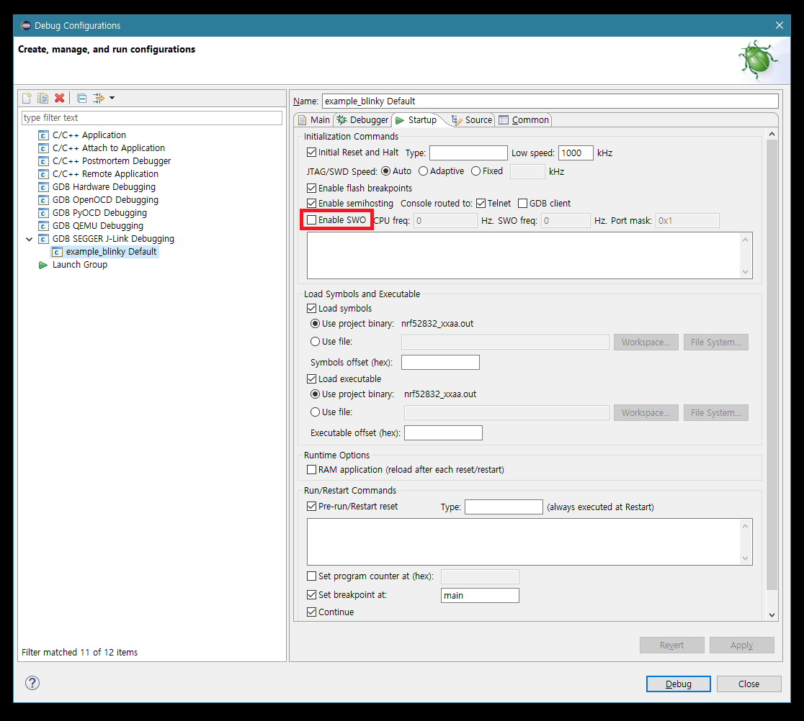
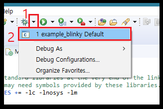

# 6. 이클립스에서 기본 프로젝트 디버깅하기

디버깅은 프로그래밍에 있어서 피할 수 없는 부분 입니다. 특히 임베디드 개발의 디버깅은 \(QEMU를 쓰지 않는 이상\) 개발 시스템과 타겟 시스템이 분리된 상황에서의 디버깅이기 때문에 그 어려움이 더 크다고 할 수 있습니다.

다행스럽게도, GDB와 JLink는 이러한 작업에 필요한 기능을 모두 제공해 주며, 몇가지 설정만으로 쉽게 사용이 가능 합니다.

J-Link 드라이버와 디버깅 서버, ARM-GDB, 그리고 GNU MCU Eclipse의 J-Link debugging 애드온 패키지 등이 초반에 이미 설치 된 상태 이므로, 이클립스의 디버거 설정 몇가지만 손 본다면 import하고 compile한 example\_blinky 프로젝트를 대상으로 쉽게 디버깅을 진행할 수 있습니다.

## 6.1 디버깅 옵션 설정하기 - Main 탭

아래 과정을 통해 이클립스 내에서 디버깅 옵션을 설정하는 메뉴와 순서를 알아 봅니다.

* 먼저, 상단 메뉴의 Run &gt;&gt; Debug Configuration을 실행 합니다.  
* 좌측 리스트의 메뉴 중, **GDB SEGGER J-Link Debugging**을 **오른쪽 클릭**하고 **New**를 실행 합니다. 
* 생성 되는 아이템은 **프로젝트 이름 + Default**가 됩니다. 해당 아이템을 클릭하면 구체적인 옵션을 변경할 수 있습니다.
* 클릭 시에 최초로 Main 탭을 볼 수 있습니다. 여기서는 수정할 사항이 없습니다. \(GNU MCU Eclipse 애드온이 자동으로 입력\)
* Project와 C/C++ Application 항목이 제대로 입력 되어 있지 않은 경우에는 Browse와 Search Project를 통해 적절한 항목을 설정해 줍니다.  

## 6.2 디버깅 옵션 설정하기 - Debugger 탭

아래 과정을 통해 디버깅 옵션에서 디버거에 전달할 구체적인 옵션을 설정 합니다.

* 먼저 Executable 이 위 화면과 동일한지 확인 합니다. 저 값들은 이클립스 내의 변수명들이며 실제 값은 J-Link의 디렉토리 위치와 JLinkGDBServerCL.exe의 위치를 가리키고 있습니다.
* 따라서 저 값들이 제대로 설정되어 있는 경우에, 그 밑의 Actual executable이 현재 설치된 exe 파일의 위치와 이름을 나타내야 합니다. 
* Other options에서는 따로 수정할 사항은 없습니다. 그러나 개발용 보드 **여러개가 PC와 연결 된 상황**이라면 **-nugui**를 지워야, 디버깅 서버가 어느 개발용 보드와 통신할지 선택하는 다이얼로그가 나타납니다. 우리는 개발용 보드가 하나 뿐이므로 그냥 두도록 합니다. 
* GDB Client Setup의 Executable에 arm-none-eabi-gdb가 정확히 입력 되어 있는지 확인 합니다. 

## 6.3 디버깅 옵션 설정하기 - Startup 탭

* 특별히 설정한 바가 없다면 Enable SWO의 체크 박스를 해제 해줍니다. \(SWO는 SWD 디버깅 프로브들을 위한 디버깅 콘솔 설정입니다만, 현재는 활성화하지 않고 넘어가도록 하겠습니다.\)

## 6.4 디버깅 해보기

디버깅을 위한 모든 설정이 끝났으므로 하단의 **Debug** 버튼을 클릭 합니다.

특별히 문제가 없다면 이클립스는 Debug Perspective로 전환 되며 디버깅하기 편리한 UI가 있는 화면으로 바뀌게 됩니다.

그 화면에서 브레이크 포인트를 설정하고 변수 값을 추적 및 확인하는 작업을 진행하면 되겠습니다.

## 6.5 팁

### 6.5.1 디버깅 모드를 시작할 때...

위 화면은 Programming Perspective에서 Debug Perspective로 넘어가는 방법을 보여주고 있습니다.

한번 Debug Configuration을 통해 Debug 모드로 진입하면 저 **벌레 버튼\(...\) 옆**의 드롭다운 메뉴에 디버그 모드를 바로 실행할 수 있는 단축키가 자동으로 추가 됩니다. 이를 통해 여러번 클릭을 반복하는 번거로움 없이 쉽게 디버그 모드로 진입이 가능하게 됩니다.

### 6.5.2 디버거가 브레이크 포인트를 못 찾을 때...

소프트 디바이스를 다시 다운로드 해 줍니다.   

특히 main.c에서 사용하는 몇가지 API 들이 소프트 디바이스에 의존적이기 때문에, 소프트 디바이스가 지워지거나 한 경우에 디버거가 해당 API의 주소를 못 찾을 수 있습니다.

